<h1 align="center">
  SPAIR  
</h1>

<div align="center" style="font-size:18px"> 
  나랑 같이 운동하자! <br />
  내 <b>PAIR</b> 찾기 
</div>

## ✨ Feature

### 메인화면
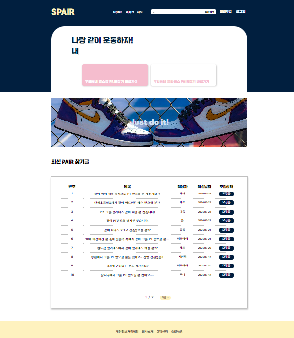

<br />

### 회원가입 및 로그인
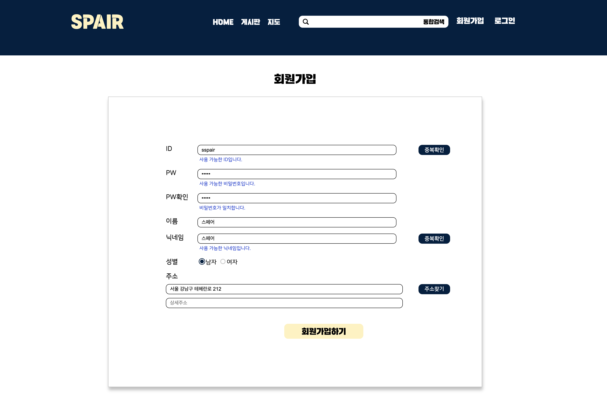

<br />

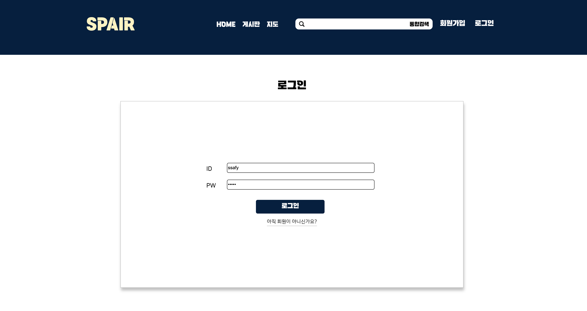

<br />
<br />

### 게시글 조회, 등록
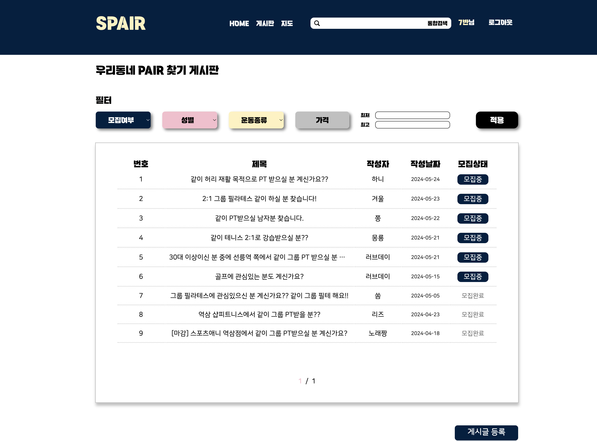

<br />

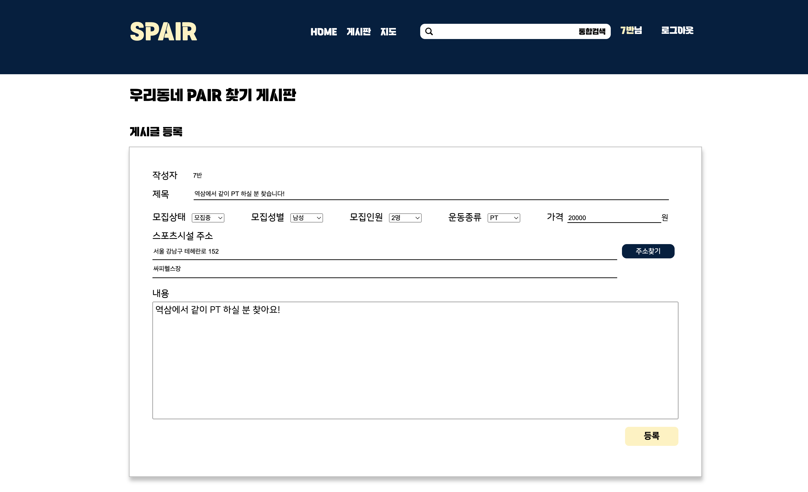

<br />

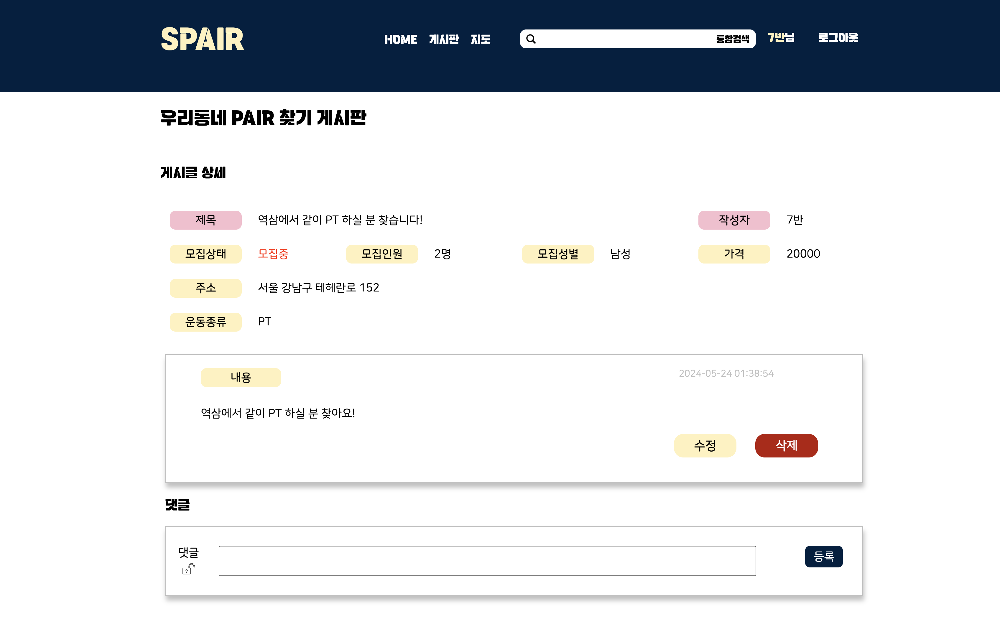

<br />
<br />

### 댓글 조회, 등록

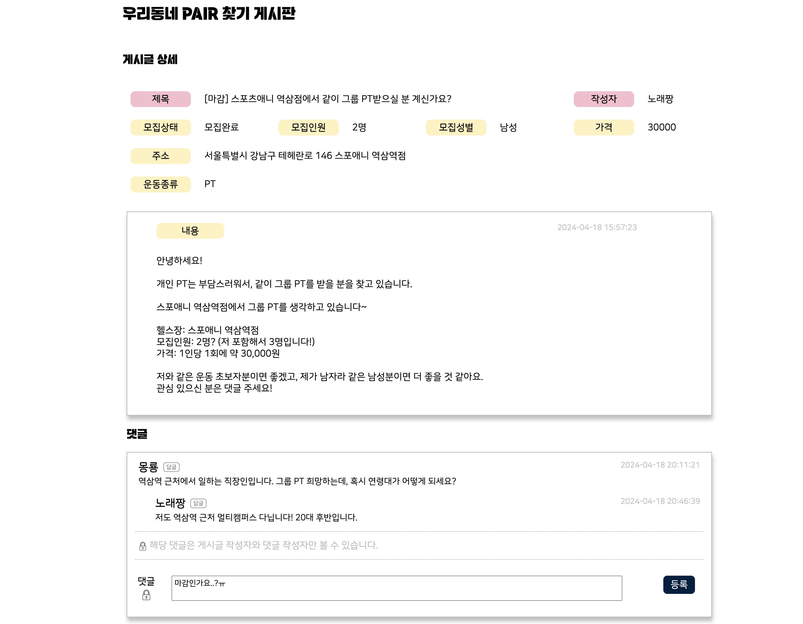

<br />

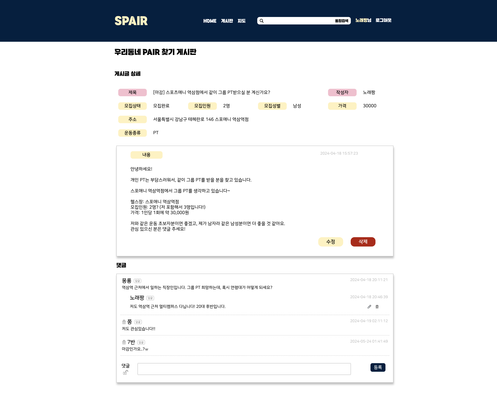

<br />
<br />

### 키워드 통합검색

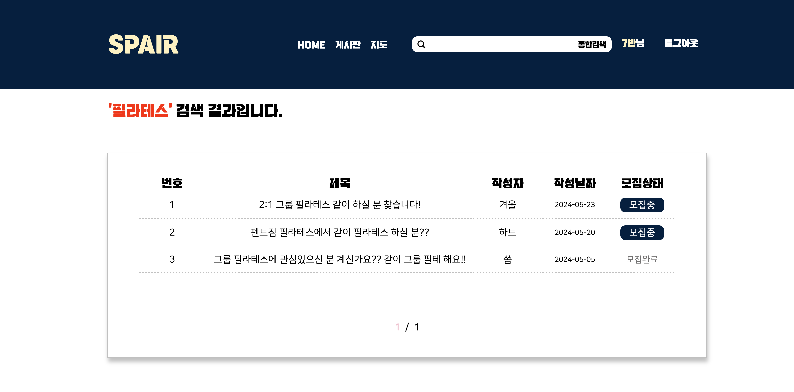

<br />

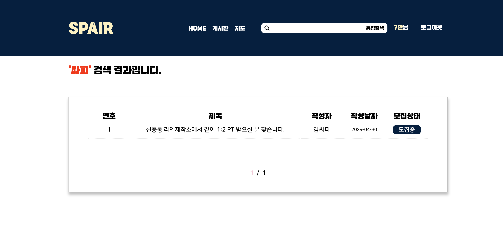

<br />
<br />

### 게시글 필터

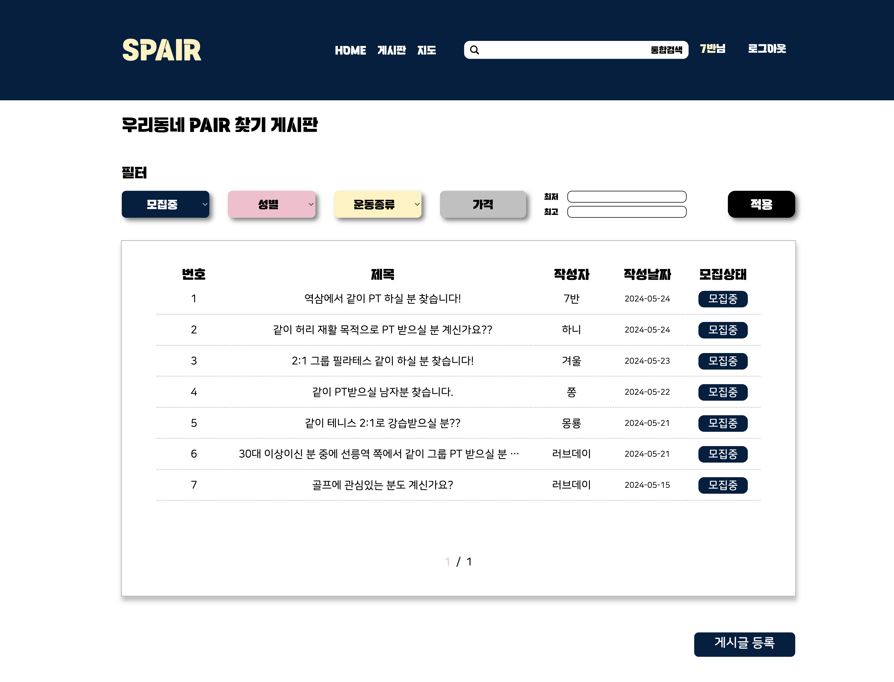

<br />

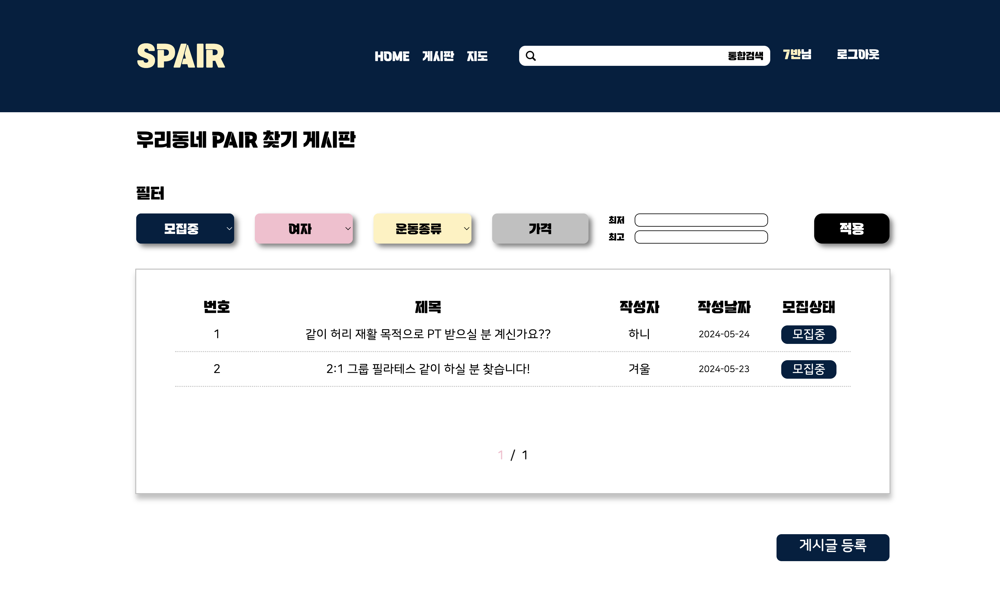

<br />

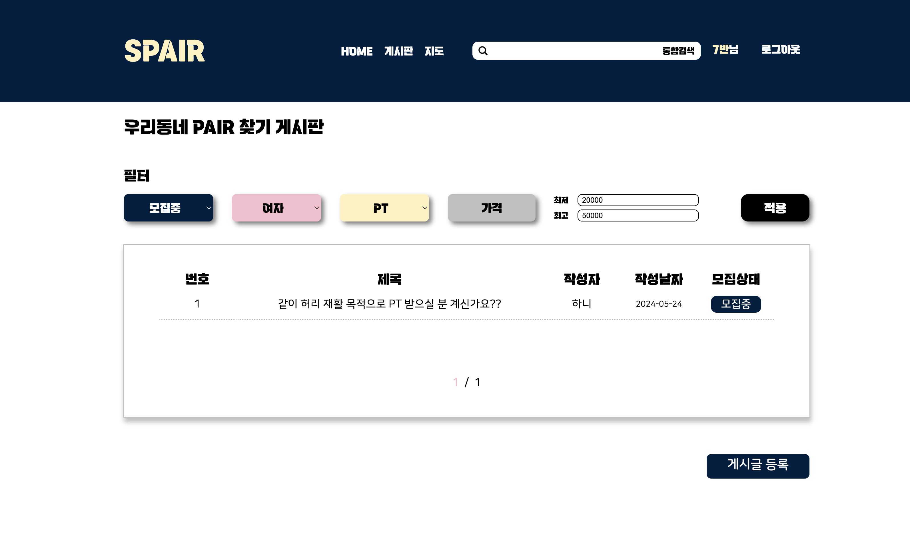

<br />
<br />

### 지도에서 게시글 모아보기


<br />


<br />
<br />

## 💻 Tech Stack
<p align="center">
  <b>FRONT</b>
  <br />
  
  
  
  
  
  <br />
  <br />
  <b>BACK</b>
  <br />
  
  
  
  <br />
  <br />
  <br />
  
  
  
  
  
</p>

```
Frontend: HTML, CSS, JavaScript, Vue, Vite
Backend : JAVA, SpringBoot
Database: MySQL
API Documentation : Swagger
Others: Figma, Github, Notion
```

<br />
<br />

## 🔧 API

### 회원


### 게시글


### 댓글


### 검색


<br />
<br />

## 🤷‍♀️ How to start

### 1. 프로젝트 Repository Clone
```
$ git clone https://github.com/ssafy11-seoul07/PJT-FINAL-C-SJ-SH.git
```

### 2. Schema 실행
```
파일 위치 : back > src > main > resources > schema.sql
```

### 3. front 폴더의 spair-project 폴더 내부에서 npm install
```
$ npm install
```

### 4. front 폴더의 spair-project 폴더 내부에 `.env.local` 파일 추가
```
VITE_KAKAO_REST_API_KEY = 
VITE_KAKAO_JS_KEY = 
```

### 5. Spring Boot 사용해서 Backend 서버 실행

### 6. Front 서버 실행
```
$ npm run dev
```

<br />
<br />

## 👩‍💻 Member

<div align="center">

|||
|:-:|:-:|
|tomato_o<br/>[@ssafy11thseoul](https://github.com/ssafy11thseoul)<br/>1역할 : Front 개발 <br/> 2역할 : 디자이너|서희<br/>[@seoh77](https://github.com/seoh77)<br/>1역할 : Back 개발 <br/> 2역할 : Front 개발|

</div>

<br />
<br />