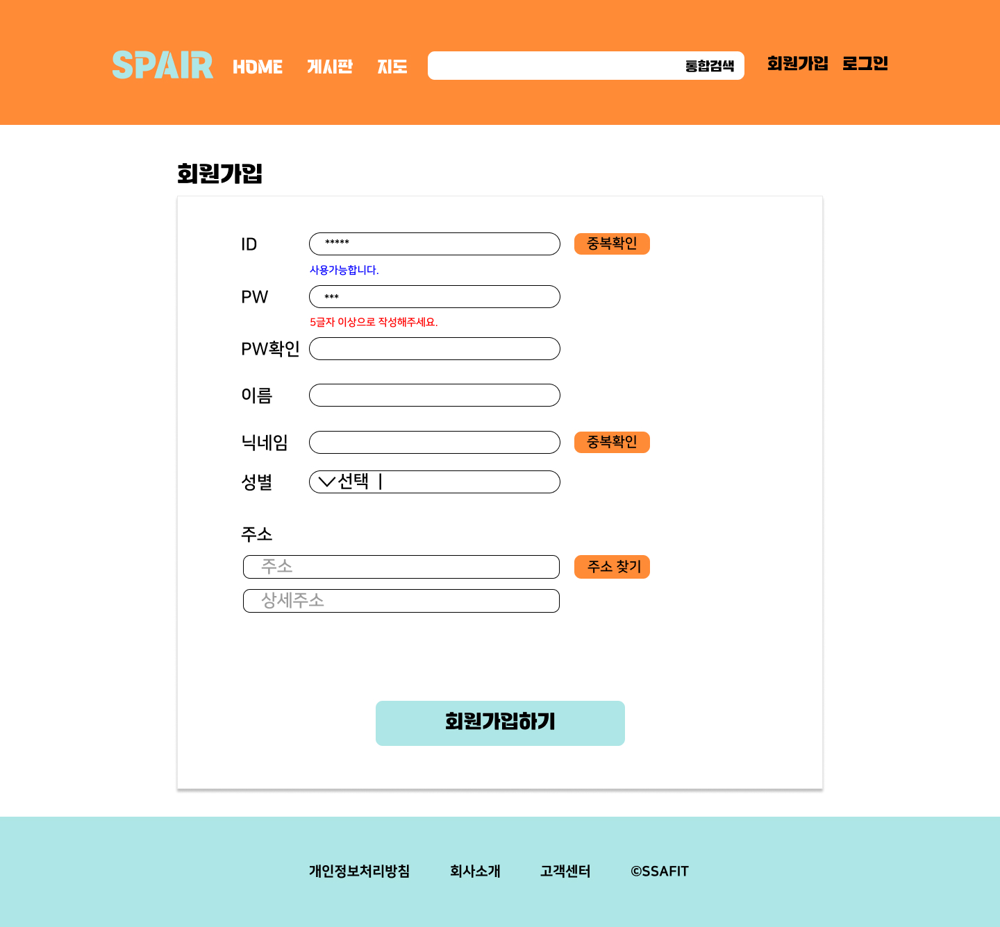

# ✅ 프로젝트 정보 
1. PJT명: SPAIR(Sports Pair) PROJECT
2. 단계: 1학기 관통 PJT
3. 작성날짜: 2024-05-09

# ✅ 프로젝트 목표
- Spring Boot와 Vue를 연동하여 웹 사이트를 구축한다.
- 스포츠 페어를 구하는 게시판 CRUD를 구현한다.
- 카카오맵API를 이용해 입력받은 위치의 특정 범위 내 스포츠 시설을 검색하는 기능을 구현한다. 

# ✅ 작업 순서
1. ~~기획~~ (04.28 완료)
2. ~~DB 설계~~ (05.03 완료)
3. ~~피그마 작업~~(05.08 완료)
4. 백엔드 및 프론트 개발 시작
   - 백엔드 개발 
     - 초기 셋팅 (05.10 완료)
     - REST API (05.15까지 완료) 
   - 프론트 개발 시작
     - ~~초기 셋팅~~ (05.08 완료)
     - 퍼블리싱(HTML,CSS) (05.15까지 완료)
5. API 연동 및 기타 작업 (05.22까지 완료)
   - REST API 연결(회원, 게시판, 검색, 댓글) (05.19일까지 완료)
   - 카카오맵 API 연결 및 마무리 (05.22일까지 완료)
6. 발표 자료 정리 (05.23까지 완료)
  
   
# ✅ 프로젝트 설계 
## 🗃️ DB ERD 

## 🖼️ 피그마 목업
### main화면(로그인x)

---
### main화면(로그인O)

---
### 회원가입

---
### 중복확인(가능한 경우, 중복인 경우) 

---
### 로그인

---
### 게시판

---
### 게시글 등록

---
### 게시글 상세

---
### 지도

---
### 색상표

---
### 통합검색결과

# ✅ 사용 API
## 1. REST API

## 2. OPEN API: 카카오맵 API, 카카오 도로명주소 API

