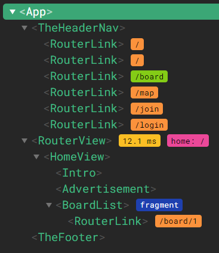
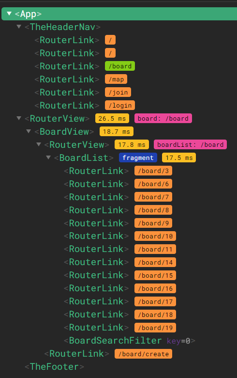
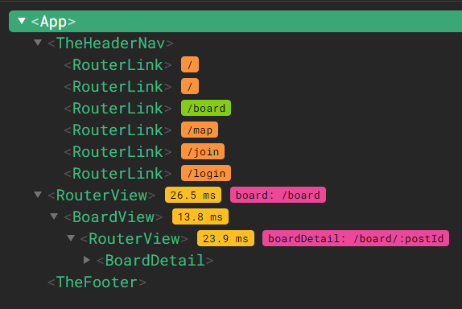
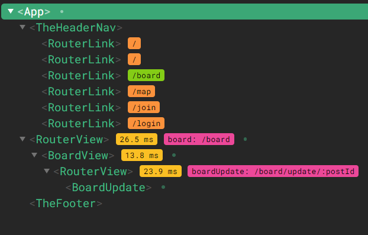
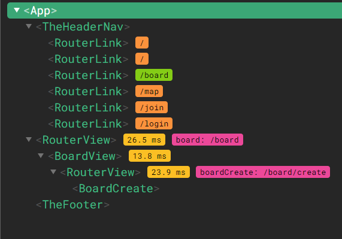
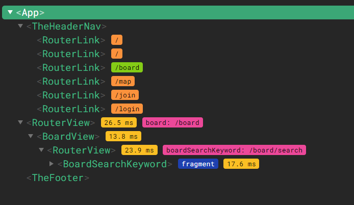

# ✅ 작성정보
1. 작 성 자: 서울 7반 문선정
2. 날 짜: 2024 - 05 - 23까지 작업 내용
3. 환 경: Windows 10
4. 개발도구: VisualStudioCode, Vue, figma
5. 사용언어: JavaScript 
6. 작성목적: 프로젝트를 진행함에 따라 각 과정들에서 작업한 내용 소개 및 기획 의도 전달

# ✅ 프로젝트
1. 프로젝트 명: Spair
2. 프로젝트 소개: Sports Pair 찾기 게시판 및 스포츠시설 검색
3. main 역할: 피그마 작업, 프론트엔드 

# ✅ 작업 내용
- 유저 플로우 차트
- 피그마 목업 작업
- 뷰 컴포넌트 생성 및 구조 설정
- 프론트엔드
- 발표 자료 제작

# ✅ 작업 내용 상세
## 1. 🤗 유저 플로우 차트 
- 추가 예정
## 2. 🎨 피그마 목업 작업
- 추가 예정
## 3. 📁 뷰 컴포넌트 생성 및 구조 설정
### 전체 폴더 구조(최신 기준)
```
🎯 spair-project
├─ .gitignore
├─ index.html
├─ jsconfig.json
├─ package-lock.json
├─ package.json
├─ public
│  └─ favicon.ico
├─ README.md
├─ src
│  ├─ App.vue
│  ├─ 🗂️ assets
│  │  ├─ delete.png
│  │  ├─ main.css
│  │  └─ update.png
│  ├─ 🗂️ components
│  │  ├─ 📋 board
│  │  │  ├─ BoardCreate.vue
│  │  │  ├─ BoardDetail.vue
│  │  │  ├─ BoardList.vue
│  │  │  ├─ BoardSearchFilter.vue
│  │  │  ├─ BoardSearchKeyword.vue
│  │  │  └─ BoardUpdate.vue
│  │  ├─ 😊 comment
│  │  │  ├─ CommentCreate.vue
│  │  │  └─ CommentList.vue
│  │  ├─ 🚩 common
│  │  │  ├─ TheFooter.vue
│  │  │  └─ TheHeaderNav.vue
│  │  └─ 🏠 home
│  │     ├─ Advertisement.vue
│  │     └─ Intro.vue
│  ├─ main.js
│  ├─ 🗂️ router
│  │  └─ index.js
│  ├─ 🗂️ stores
│  │  └─ board.js
│  └─ 🗂️ views
│     ├─ BoardView.vue
│     ├─ HomeView.vue
│     ├─ JoinView.vue
│     ├─ LoginView.vue
│     └─ MapView.vue
└─ vite.config.js
```
### 라우터 구조
```
const router = createRouter({
  history: createWebHistory(import.meta.env.BASE_URL),
  routes: [
    {
      path: '/',
      name: 'home',
      component: HomeView
    },
    {
      path: '/board',
      name: 'board',
      component: BoardView,
      children: [
        {
          path: '', 
          name: 'boardList',
          component: BoardList
        },
        {
          path: 'create', 
          name: 'boardCreate',
          component: BoardCreate
        },
        {
          path: 'search', 
          name: 'boardSearchKeyword',
          component: BoardSearchKeyword
        },
        {
          path: 'update/:postId', 
          name: 'boardUpdate',
          component: BoardUpdate
        }, 
        {
          // Pathvariable처럼 동적 라우팅 :id
          path: ':postId', 
          name: 'boardDetail',
          component: BoardDetail,
          children: [
            {
              path: '', 
              name: 'commentList',
              component: CommentList
            },
            { path: 'create',
              name: 'commentCreate',
              component: CommentCreate
            },
          ]
        },
      ]
    },
    {
      path: '/join',
      name: 'join',
      component: JoinView
    },
    {
      path: '/login',
      name: 'login',
      component: LoginView
    },
    {
      path: '/map',
      name: 'map',
      component: MapView
    },
    
  ]
})
```
### A. App.vue와 view 폴더
### (1) App.vue

```
<template>
  <div id="container">
    <TheHeaderNav/>
    <RouterView />
    <TheFooter/>
  </div>
</template>
```
- App.vue에 어느 도메인으로 들어가든 항상 존재해야하는 네비게이션 바 역할의 TheHeaderNav.vue, 푸터 역할의 TheFooter.vue를 자식으로 import
- RouterView를 통해 도메인 주소에 따라 view를 관리할 수 있도록 설정
- 첫 홈페이지 진입시 보이는 화면은 HomeView에서의 화면과 같음

### (2) HomeView.vue

```
<template>
  <main>
      <Intro/>
      <Advertisement/>
      <div id="title">
        최신 PAIR 찾기글
      </div>
      <BoardList/>
  </main>
</template>
```
- 도메인 주소: http://localhost:5173/
- Intro.vue와 Advertisement.vue를 자식으로 import
- BoardList.vue를 자식으로 import하여 전체(전국) 게시글을 반환
- 로그인을 안해도 게시글 목록은 조회할 수 있지만 상세 페이지는 접근 불가 

### (3) BoardView.vue

```
<template>
    <div id="boardview-container">
        <div v-if="$route.path !== '/board/search'" id="title">우리동네 PAIR 찾기 게시판</div>
        
        <RouterView/>
        <div v-if="$route.path == '/board'" id="link">
            <RouterLink :to="{ name: 'boardCreate' }">게시글 등록</RouterLink>
        </div>
    </div>
</template>
```
- 도메인 주소: http://localhost:5173/board
- 로그인 시에만 접근 가능
- 로그인한 유저 정보에 저장된 주소(위도, 경도)를 기반으로, 해당 유저의 동네에 위치한 스포츠시설과 관련된 게시글만 조회되도록 구성
- v-if 사용으로 코드 재사용성 고려
  - 통합검색 시 결과에도 이용하기 위해 '우리동네 PAIR 찾기 게시판' div는 URL 경로가 '/board/search'가 아닌 경우에만 등장하도록 v-if 사용
  - RouterView에 BoardList를 ''으로 연결해 BoardList가 바로 나오도록 구현
  - 게시글 등록 버튼은 RouterLink로 만들어 BoardCreate.vue로 바로 갈 수 있게 설정
    - 다만 게시글 상세 페이자나 게시글 등록 페이지에서도 계속 떠 있으면 안되므로 URL 경로가 '/board'일 때만 등장하도록 v-if 사용

### (4) JoinView.vue, LoginView.vue, MapView.vue
- 사진 추가 필요
- 컴포넌트 구조만 생성.
- 세부 내용은 서희가 구현


### B. components/common 폴더
- 추가 필요

### C. components/home 폴더
- 추가 필요

### D. components/board 폴더
### (1) BoardList.vue

- 도메인 주소: http://localhost:5173/board
- 추가 예정
- BoardSearchFilter를 자식으로 import
  - URL 경로가 '/board'일 때만 화면에 그려짐 (등록/수정/상세/검색 페이지에서 뜨지 않음)
  - 초기 진입시에는 우리 동네의 전체 PAIR 찾기 게시글이 조회됨
  - BoardSearchFilter에서 적용버튼을 누르면 emit으로 applyFilters이벤트 발생
- 게시글 목록에서 각 게시글의 제목을 누르면 BoardDetail.vue로 가도록 RouterLink 설정

### (2) BoardSearchFilter.vue
- 여기서는 axios 호출 X
- emit 이벤트 발생시키고 상위의 BoardList에서 axios 호출하도록 설정

### (3) BoardDetail.vue

- 도메인 주소(예시): http://localhost:5173/board/3
- 게시글의 postId를 기준으로 해당 postId와 일치하는 상세 페이지를 반환
- 수정 버튼을 누르면 BoardUpdate.vue로 가도록 router.push
- 삭제 버튼을 누르면 Rest API 연결로 개사물 삭제 로직을 진행한 후 다시 boardList로 router.push

### (4) BoardUpdate.vue

- 도메인 주소(예시): http://localhost:5173/board/update/3
- 게시글의 postId를 기준으로 해당 postId와 일치하는 수정 페이지를 반환
- 작성자, 운동종류, 스포츠시설의 주소는 바꿀 수 없음(타 사용자의 UX고려)
- Rest API 연결로 게시물 수정 로직을 수행한 후 다시 boardList로 router.push

### (5) BoardCreate.vue

- 도메인 주소: http://localhost:5173/board/create
- BoardView에 작성한 대로 '우리 동네 PAIR찾기 게시판'div는 항상 화면에 그려짐
- RouterView에 연결된 BoardCreate.vue가 반환됨
- 등록 버튼을 누르면 다시 BoardList로 이동('/board')

### (6) BoardSearchKeyword.vue

- 구현 후 사진 수정 필요 
- 도메인 주소(예시): http://localhost:5173/board/search?search=고양이
- TheHeaderNav.vue의 input태그에서 입력받은 searchQuery(keyword)가 화면에 나타나도록 구성
  - (예시) : '고양이'결과입니다.
- 전체(전국) 게시글을 기준으로 제목이나 작성자에 searchQuery(keyword)가 포함된 게시글을 반환
- 여기서는 BoardSearchFilter가 나타나지 않음

### E. components/comment 폴더

